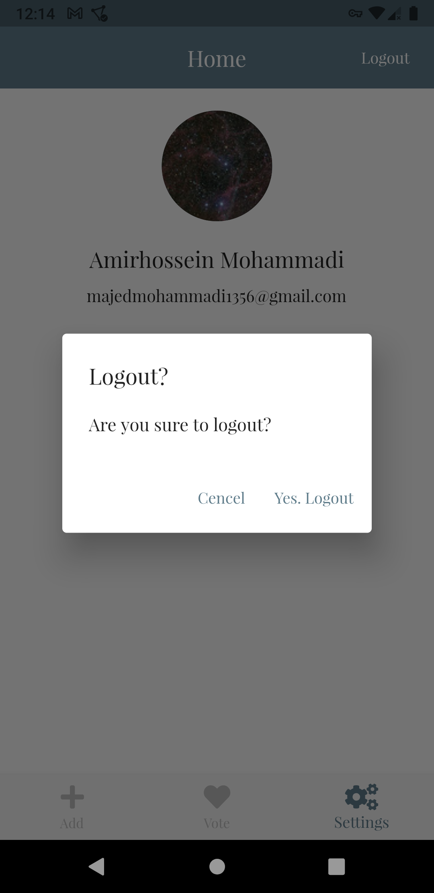
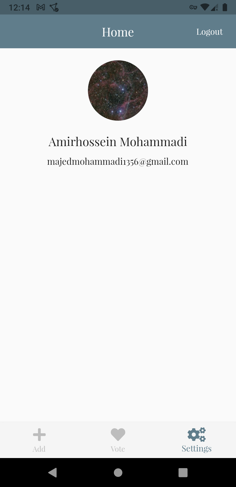

# Google Firebase Services

**Note: Some parts are not committed and they are on working.**

It this practical project we learned **Firebase Authentication** and **Firebase Firestore** in a higher level.

### Lessons and what we covered

In previous practical projects ([CafeBase](https://github.com/BlackIQ/cafebase)) we just learned about these things:

- Flutter
  - Bottom modal for settings
- Firebase setup
  - Setup for Android
- Firebase Authentications
  - Anonymous Authentication
  - Email Authentication
    - Email login
    - Email registration
  - Logout
- Firebase Firestore
  - Read date without specific query
  - Insert data _Create one new document_

But in this project we cover more lessons. Like:

- Flutter
  - Alert dialog for logout
  - Bottom navigation bar
  - Using GoogleFonts
  - Settings to show user image and other stuff
- Firebase setup
  - Setup for iOS
- Firebase Authentications
  - Google Authentication
  - Access to user objects
    - Name
    - Photo
    - Email
    - Phone
- Firebase Firestore
  - Read date with specific query
  - Update a document

### Images

Here are some images that you can see.

- _Firebase Firestore_
  

- _Firebase Authentication_
  

- _Landing page_
  

- _Adding page_
  

- _Logout_
  

- _Settings page (profile)_
  

- _Voting page_
  

### TODOs

- [x] Insert a new user by user
- [x] Add more screenshots of application
- [x] Fix boolean in adding user

### Next practical project?

Next practical project for **Firebase** and **Flutter** will be focus on **Firestore** more. In summary, things will be cover are listed below:

- Flutter
  - Theme and settings for theme
  - Dark and light mode
- Firebase Authentication
  - Apple Authentication
  - Github Authentication
  - Twitter Authentication
- Firebase Firestore
  - Deep dive in Firestore and lots of new stuff for it
- Firebase Real-Time
  - Take a short look of what is **Firebase real-time database**
